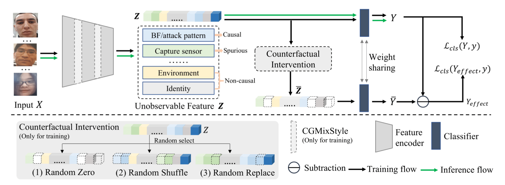

# Face Presentation Attack Detection by Eacavating Causal Clues and Adapting Embedding Statistics


---
This is the a repository that fork and edit from the paper: Face Presentation Attack Detection by Eacavating Causal Clues and Adapting Embedding Statistics, accepted at WACV 2024. The paper can be found in [here](https://arxiv.org/abs/2308.14551).

## Pipeline Overview


## Data format
The format of the `binary classification` dataset CSV file is:
```
image_path,label
/image_dir/image_file_1.png, bonafide
/image_dir/image_file_2.png, bonafide
/image_dir/image_file_3.png, attack
/image_dir/image_file_4.png, attack
```
The format of the `multi-label classification` dataset CSV file is:
```
image_path,label
/image_dir/image_file_1.png, bonafide
/image_dir/image_file_2.png, 3d_mask
/image_dir/image_file_3.png, print
/image_dir/image_file_4.png, paper_cut
/image_dir/image_file_5.png, replay
```


## Training
Example of training:
```
python train.py \
  --training_csv train.csv \
  --test_csv test.csv
  --prefix 'custom_note' \
  --num_classes {int} \
  --multiclass {bool}
```
Check --ops for different counterfactual interventions.

## Testing
Example of testing:
```
python test.py \
  --test_csv 'test_data.csv' \
  --model_path 'model.pth' \
  --num_classes {int} \
  --multiclass {bool}
```
where test_data.csv contains image path and the corresponding label (bonafide or attack (3d mask, print, replay, paper cut)).

## OpenCam
Example of using pc camera:
```
python test_cam.py \
  --model_path 'model.pth' \
  --num_classes {int} \
```
where num classes depend on testing binary classification or multi-label classification.

## OpenGradCam
Example of using pc camera with using [Gradcam](https://github.com/jacobgil/pytorch-grad-cam) that is an eplainable AI for computer vision:
```
python test_gradcam.py \
  --model_path 'model.pth' \
  --num_classes {int} \
```
where num classes depend on testing binary classification or multi-label classification.